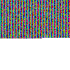

# CS - Color Storage
> this is not suitable to be implemented
> as QR codes are implemented today,
> as most cameras that come on smartphones won't
> be capable of processing each pixel as a different color.
> this is only practical on a computer with my python script.

welcome to CS! here's a few example images of how this works:

this reads `hello world!`

this one reads `the quick brown fox jumps over the lazy dog`

this one reads the first 100 digits of π. (pi)
and finally, for a very large example, 

this is the first 14,000 digits of pi, only taking up around half of the 100x100 pixel radius.

you can use my little python script, and hopefully make versions of it in other languages too, to fit your needs.
